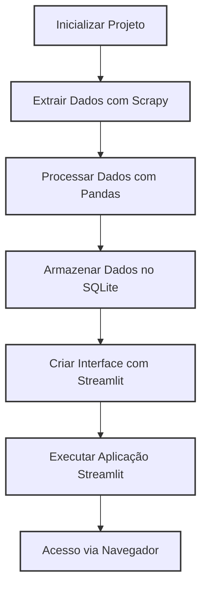

# Projeto de Extração e Visualização de Dados de Tênis do Mercado Livre

Este projeto utiliza Python, Scrapy, SQLite3 e Streamlit para extrair dados de tênis esportivos do Mercado Livre, realizar transformações utilizando Pandas, armazenar os dados em um banco SQLite e criar uma interface de visualização de dados utilizando Streamlit.



## Funcionalidades Principais

1. **Extração de Dados com Scrapy:**
   - Utiliza o framework Scrapy para realizar a extração de dados de tênis disponíveis no Mercado Livre.
   - O Spider criado navega pelas páginas de busca, extrai informações como título, marca, preço, informações de avaliação de produto e link para detalhes.

2. **Transformação de Dados com Pandas:**
   - Os dados extraídos são processados e limpos utilizando Pandas para melhor análise e armazenamento.
   - Exemplos de transformações incluem a conversão de formatos de preço e tratamento de dados faltantes.

3. **Armazenamento em SQLite:**
   - Utiliza SQLite3 para criar um banco de dados local.
   - Os dados limpos são inseridos no banco SQLite, permitindo consultas e análises futuras.

4. **Visualização de Dados com Streamlit:**
   - Cria uma interface interativa utilizando Streamlit.
   - A interface permite visualizar estatísticas sobre os dados coletados.

## Estrutura do Projeto

O projeto está estruturado da seguinte forma:

```plaintext
|-- src/
|   |-- scrapy.cfg
|   |-- collect/
|   |   |-- __init__.py
|   |   |-- items.py
|   |   |-- settings.py
|   |   |-- spiders/
|   |       |-- __init__.py
|   |       |-- ml_data_spider.py
|   |-- transform/
|   |   |-- main.py
|   |
|-- data/
|   |-- quotes.db
|   |
|-- app/
|   |-- app.py
|   |
|-- .gitignore
|-- .python-version
|-- template.env
|-- README.MD
|-- requirements.txt
```

- **src/**: Contém o código do Scrapy para extração de dados do Mercado Livre.
- **data/**: Diretório onde o banco de dados SQLite é armazenado.
- **app/**: Código para a aplicação Streamlit que visualiza os dados.

## Executando o Projeto

### Requisitos

- Python 3.7+

Para executar o projeto localmente, siga os passos abaixo:

1. **Clonar o Repositório**:
   ```bash
   git clone <URL-do-Repositório>
   cd <Nome-do-Repositório>
   ```

2. **Instale as dependências:**
   ```bash
   pip install -r requirements.txt
   ```

3. **Execute o Scrapy para extrair dados:**
   ```bash
   cd scrapy_project
   scrapy crawl ml_data_spider -o dados_tenis.json
   ```

4. **Transforme e carregue os dados no SQLite:**
   ```bash
   python transform_load.py
   ```

5. **Execute a aplicação Streamlit:**
   ```bash
   streamlit run ./app/app.py
   ```

6. **Acesse a aplicação Streamlit:**
   Abra o navegador e vá para `http://localhost:8501` para visualizar a interface.

## Contribuições

Para contribuir com o projeto, por favor, faça um fork do repositório e envie um pull request com suas alterações.
