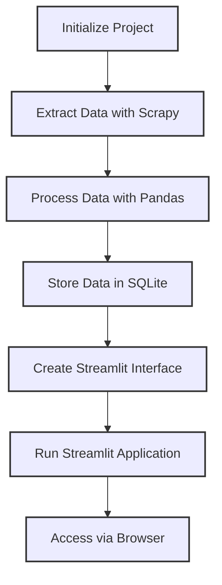

# Sports Shoes Data Extraction and Visualization Project from Mercado Livre

This is a simple project I made for my personal use. This Python project utilizes Scrapy, SQLite3, and Streamlit to extract sports shoes data from Mercado Livre, perform data transformations with Pandas, store the data in an SQLite database, and create an interactive dashboard highlighting key KPIs using Streamlit.



## Key Features

1. **Data Extraction with Scrapy:**
   - Uses Scrapy framework to scrape sports shoes data from Mercado Livre
   - Custom spider navigates search pages, extracting product details including:
     - Title and brand
     - Pricing information
     - Product ratings
     - Product detail URLs

2. **Data Transformation with Pandas:**
   - Performs data cleaning and processing for analysis
   - Key transformations include:
     - Price format standardization
     - Missing value handling
     - Data type conversions

3. **SQLite Storage:**
   - Creates a local SQLite database for efficient data storage
   - Stores processed data for future queries and analysis

4. **Streamlit Dashboard:**
   - Interactive web interface for data visualization
   - Displays key performance indicators (KPIs)
   - Provides insights into sports shoes market trends

## Project Structure

```
├── app/
│   └── app.py                 # Streamlit application
├── data/
│   └── quotes.db              # SQLite database
├── poetry.lock                # Dependency locks
├── pyproject.toml             # Project configuration
├── src/
│   ├── collect/               # Scrapy project
│   │   ├── __init__.py
│   │   ├── items.py           # Data structure definitions
│   │   ├── settings.py        # Scrapy settings
│   │   └── spiders/
│   │       ├── __init__.py
│   │       └── ml_data_spider.py  # Main spider
│   ├── scrapy.cfg             # Scrapy configuration
│   └── transform/
│       └── transform_load.py  # Data processing scripts
└── template.env               # Environment template
```

## Getting Started

### Prerequisites

- Python 3.7+
- Poetry

### Installation

1. **Clone the repository:**
   ```bash
   git clone <repository-url>
   cd <project-directory>
   ```

2. **Install dependencies:**

   ```bash
   poetry install
   ```

### Execution

1. **Run Scrapy spider:**
   ```bash
   cd src/collect
   scrapy crawl ml_data_spider -o sports_shoes_data.jsonl
   ```

2. **Process and load data:**
   ```bash
   python src/transform/transform_load.py
   ```

3. **Launch Streamlit app:**
   ```bash
   streamlit run app/app.py
   ```

4. **Access the dashboard:**
   Open your browser to `http://localhost:8501`

## Contributing

We welcome contributions!:

1. Fork the repository
2. Create your feature branch
3. Commit your changes
4. Push to the branch
5. Open a pull request
